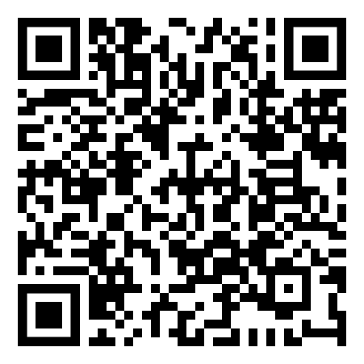

# TripDocs - All Documents At Hand

## Descripción del proyecto
App destinada a viajeros, que dispone de una serie de funcionalidades que facilitan la gestión de la documentación requerida en los viajes.
## Objetivo del proyecto
Facilitar a los usuarios una aplicación especializada en la documentación requerida en los viajes, que facilite a los usuarios la gestión, utilización y conservación de la misma mediante una serie de funcionalidades que garanticen la facilidad de uso, y la imposibilidad de acceso por terceras personas a dicha documentación.
## QR APK

## Para probar la aplicación
### Usuario de Prueba
Email | profesor@gmail.com |
--- | --- |
Contraseña | Profesor1@ |
### Tarjeta de Credito de Prueba
Tarjeta de credito que se puede usar para ver como funcionara una mejora de cuenta para pasar de una cuenta Gratuita a una Pagada y desbloquear el acceso a mas de 1 perfil.

Numero de la tarjeta | 4242 4242 4242 4242 |
--- | --- |
MM/YY | 04/24 |
CVC | 424 |
Postcode | test |
